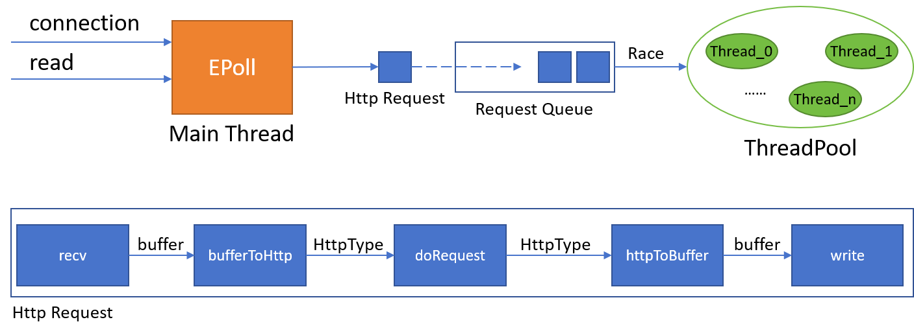

# webserver

手撕高性能服务器

## 开发环境
- Ubuntu 20.04

## 编译运行

```bash
# 项目编译
mkdir build && cd build
cmake ..
make
# 运行
./WebServer [port]
```

## 学习进度

- [x] TCP/IP协议
- [x] socket
- [x] 高性能服务器框架
- [x] I/O复用
- [x] 信号
- [x] 定时器
- [x] 高性能I/O
- [x] 多进程
- [x] 多线程
- [x] 服务器调试

## 项目进度

### webserver v0.1

**特性**

- 使用I/O多路复用技术epoll监听事件，包括socket连接请求、socket读写等；
- 将所有事件，包括I/O、定时器、异常等封装到统一的channel类，方便事件管理；
- 采用Reactor模型，主线程负责处理连接请求、任务分配以及其他异常事件，子线程处理数据读写和解析客户请求；
- 使用线程池管理多线程，避免线程重复创建和释放带来的时间开销，通过线程竞争方式分配任务；
- 采用有限状态机解析HTTP数据，确保数据的正确处理；
- 使用mmap将客户端请求的本地文件映射到socket缓冲区，实现数据的零拷贝。

**debug记录**

- 在栈区存放的request类直接加入到线程任务队列，导致成员变量被意外修改。
  解决办法：申请堆区内存，同时需要注意内存释放。

**系统框架**

<div align=center>

</div>

**WebBench压力测试**

测试环境：VMware Ubuntu 20，服务端和客户端在同一台机器，4G内存+2核CPU

测试结果：成功率能够达到100%，传输速度没有参考价值所以忽略
```bash
Webbench - Simple Web Benchmark 1.5
Copyright (c) Radim Kolar 1997-2004, GPL Open Source Software.

Benchmarking: GET http://127.0.0.1:12345/helloworld.txt
1000 clients, running 30 sec.

Speed=24962 pages/min, 60452800 bytes/sec.
Requests: 12481 susceed, 0 failed.
```

## 参考资料

- 《Linux高性能服务器编程》——游双
- [muduo开源代码](https://github.com/chenshuo/muduo)
