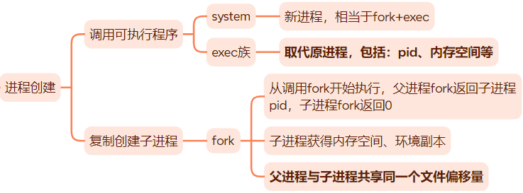
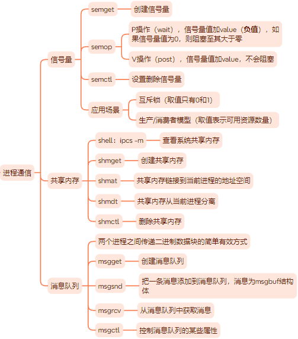

# 多进程编程

## 进程创建
<div align=center>

</div>

**补充**

调用`fork`创建子进程时：
- 数据复制采用写时复制，即对数据执行写操作时复制才会发生。
- 父进程打开文件描述符默认在子进程也是打开的，且文件描述符引用计数加1，而且用户根目录、当前工作目录等变量的引用计数均会加1.

调用`exec`函数时：
- 不会关闭原程序打开的文件描述符，除非该文件描述符被设置了类似`SOCK_CLOEXEC`的属性。

## 进程通信

<div align=center>

</div>

**补充**

- 管道是父子进程通信的常用手段，利用`fork`调用后两个管道文件描述符都保持打开实现通信。一对这样的文件描述符智能保证一个方向的数据传输，父子进程必须有一个关闭读端，另一个关闭写端。管道只能用于有关联的两个进程（父、子进程）的通信。

- Linux提供了一种利用`mmap`在无关进程之间共享内存的方式。
  ```c++
  int shm_open(const char* name, int oflag, mode_t mode); // 使用方法与open相同
  ```

- 两个不相关的进程可以传递文件描述符。
  > 传递一个文件描述符不是传递值，而是创建新的文件描述符，指向内核中相同的文件表项。

  在Linux下，可以利用UNIX域socket在进程间传递特殊的辅助数据，以实现文件描述符的传递。


