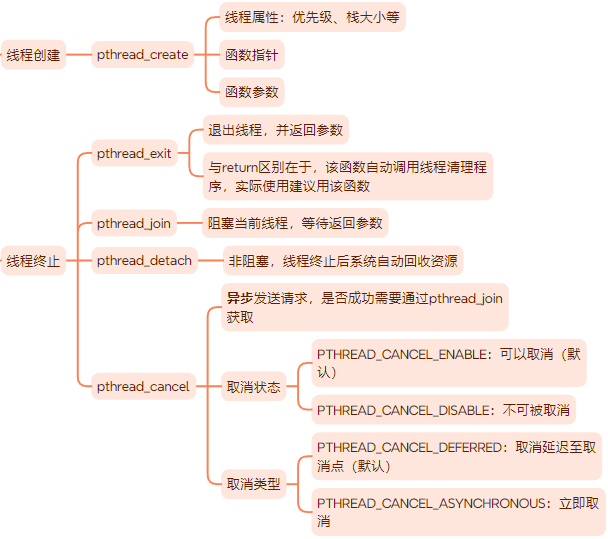
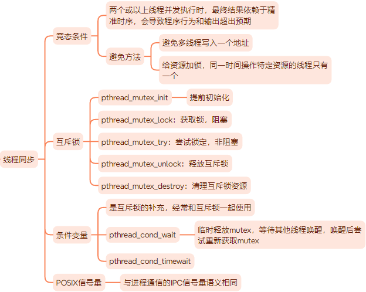

# 多线程编程

<div align=center>

</div>

<div align=center>

</div>

**补充**

- 使用互斥锁需要避免死锁：一个线程中对一个已经加锁的普通锁再次加锁，将导致死锁。例如，两个线程按照不同顺序申请两个不同的互斥锁，会导致死锁。

## 多线程环境

可重入函数：线程安全的函数，能被多个线程同时调用且不发生竞态条件。

Linux库函数只有一小部分是不可重入的，例如`inet_ntoa`、`getservbyname`等。这些库函数不可重入，主要是因为内部使用了静态变量。针对这些不可重入库函数，Linux提供了可重入版本（原函数名尾加上'_r'），例如`localtime_r`。

**线程和进程**

一个多线程程序的某个线程调用了`fork`函数，创建的子进程只拥有一个执行线程，并且继承某个线程的互斥锁状态。

子进程可能不清楚继承来的互斥锁具体状态，如果执行加锁会导致死锁。pthread库提供了一个专门的函数`pthread_atfork`，确保`fork`调用后拥有一个清楚的锁状态。
```c++
int pthread_atfork(void (*prepare)(void), void(*parent)(void), void (*child)(void));
```

**线程和信号**

每个线程都可以独立设置信号掩码。
```c++
int pthread_sigmask(int how, const sigset_t* newmask, sigset_t* oldmask);
```


