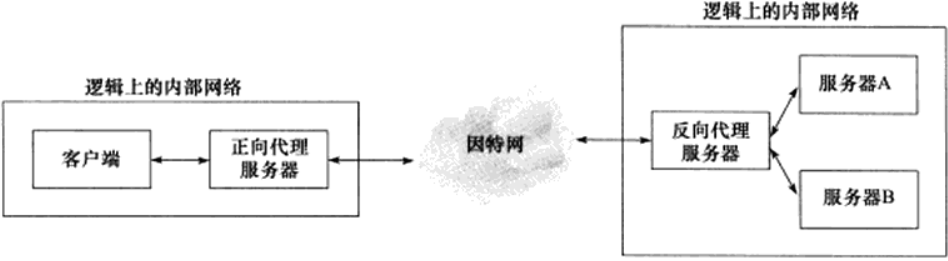

# TCP/IP协议

传输层（TCP、UDP、SCTP）封装了一条端到端的逻辑通信链路，它负责数据收发、链路的超时重连等。TCP为应用层提供可靠的、面向连接的和基于流（stream）的服务。

**数据封装**

**DNS**

通过域名访问机器，而不是其IP地址，需要使用域名查询服务DNS。Linux使用/etc/resolv.conf文件存放DNS服务器的IP地址，常用的访问DNS服务器的客户端程序是 `host` 。

## IP协议
IP协议是TCP/IP协议族的核心协议，也是socket网络编程基础之一。

IP为上层协议提供无状态、无连接、不可靠的服务。

- 无状态：以HTTP协议为例，一个浏览器连续两次网页请求之间没有任何关联。
- 无连接：IP通信双方都不长久地维持对方的任何信息。
- 不可靠：IP协议不能保证IP数据报准确地到达接收端。

IP协议的一个核心任务是数据报的路由，即决定发送数据报到目标机器的路径。

## TCP协议
和IP协议相比，TCP协议更靠近应用层，在应用程序中具有更强的可操作性。TCP协议相比于UDP特点是：面向连接、字节流和可靠传输。

- 面向连接：TCP协议连接是一对一的，通信双方必须先建立连接，分配必要的内核资源以管理传输，完成交换后释放资源。
- 字节流：应用程序对数据的发送和接收是没有边界限制的。

    

    
    

- 可靠传输：TCP协议采用发送应答机制、超时重传机制，还会对接收到的TCP报文段重排、整理，再交付给应用层。

**TCP头部结构**

- 16位端口号：TCP通信时，客户端通常使用系统自动选择的临时端口号，而服务器则使用知名服务端口号。

    > 所有知名服务使用的端口号都定义在`/etc/services`文件中

- 32位序号：假设A与B通信，在A到B的方向上，序号值被系统初始化为某个随机值ISN，TCP报文段中序号值被设置成ISN加上该报文段携带数据的第一个字节在整个字节流的偏移。

- 32位确认号：用作对另一方发送来的TCP报文段的响应。其值是收到TCP报文段的序号值加1.

- 6位标志位：
  - URG，表示紧急指针是否有效。
  - ACK，确认报文段，表示确认号是否有效。
  - PSH，提示接收端应用程序应该立即从TCP接收缓冲区中读走数据。
  - RST，复位报文段，表示要求对方重新建立连接。
  - SYN，同步报文段，表示请求建立一个连接。
  - FIN，结束报文段，表示通知对方本端要关闭连接。

**TCP连接和关闭**

TCP三次握手：
1. A发送B同步报文段，包含ISN值为a的序号。
2. B发送A同步报文段，表示同意建立连接，包含ISN值为b的序号，并且对第1个同步报文段进行确认，确认值是a+1。
3. 最后A发送B确认报文段，确认值是b+1。

**TCP状态转移**

粗虚线表示典型的服务器端连接状态转移，粗实线表示客户端。

**拥塞控制**
- 慢启动
- 拥塞避免
- 快速重传
- 快速恢复

## HTTP协议
HTTP是一种应用层协议，Web客户端和服务器之间使用HTTP协议通信。

**HTTP代理服务器**

提供对目标资源的中转访问，一个HTTP请求可能被多个代理服务器转发，按照使用方式可以划分为：
- 正向代理服务器：要求客户端自己设置代理服务器的地址，每次请求直接发送到该代理服务器。
- 反向代理服务器：被设置在服务器端，客户端无需设置。接收Internet上的连接请求，然后转发给内部网络上的服务器，并将结果返回给客户端。
    > 不同地方ping同一个域名可能得到不同的IP地址，因为这些IP地址实际上是代理服务器的IP地址。
    

    
    

- 透明代理服务器：只能设置在网关上。可以看做正向代理的一种特殊情况。

**HTTP通信**

[HTTP通信](https://developer.mozilla.org/zh-CN/docs/Web/HTTP/Guides/Overview)
