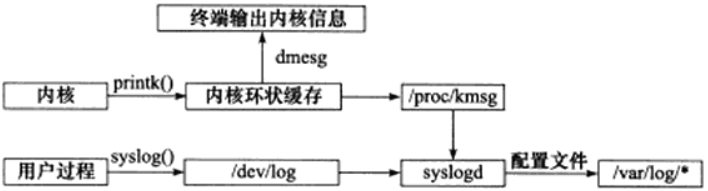

# Linxu服务器程序规范

除网络通信外，Linux服务器程序必须考虑其他细节问题，这些细节基本上是模板式的。Linux服务器程序：

- 以后台进程形式运行。后台进程又称守护进程，其父进程通常是init进程。
- 有一套日志系统。大部分后台进程在 `/var/log` 目录下拥有自己的日志记录。
- 以某个专门的非root身份运行。
- 是可配置的。服务器程序通常能处理很多命令行选项，一次运行选型太多，则可以用配置文件来管理。
- 会在启动的时候生成一个PID文件并存入 `/var/run` 目录中，以记录该后台进程的PID。
- 需要考虑系统资源和限制，以预测自身能承受多大负荷，比如可用文件描述符总数和内存总量等。

## 日志

Linux提供一个守护进程来处理系统日志rsyslogd，它既能接收用户进程输出的日志，又能接收内核日志。

<div align=center>

</div>

用户进程通过调用 `syslog` 函数生成系统日志，输出到UNIX本地域socket类型的文件 `/dev/log`。

```c++
#include <syslog.h>
void syslog(int priority, const char* message, ...);
```

`priority` 是设施值与日志级别的按位或，设施值默认是LOG_USER。

## 用户信息

真实用户ID（UID），有效用户ID（EUID），真实组（GID），有效组（EGID）。

```c++
#include <sys/types.h>
#include <unistd.h>
uid_t/gid_t getxxx();
int setxxx();
```

一个进程拥有两个用户ID：UID和EUID。EUID存在的目的是方便资源访问，它可以让运行程序的用户拥有改程序的有效用于的权限。有效用户为root的进程称为特权进程。

## 进程间的关系

**进程组**

每个进程组都有一个首领进程，其PGID和PID相同。
```c++
#include <unistd.h>
pid_t getpgid(pid_t pid);
int setpgid(pid_t pid, pid_t pgid);
```
如果设置pgid的 `pid` 和 `pgid` 相同，则由pid指定的进程担任进程组首领。

一个进程只能设置自己或子进程的PGID，并且子进程调用exec族函数后，不能在父进程设置其PGID。

**会话**

一些有关联的进程组形成一个会话。
```c++
#include <unistd.h>
pid_t getsid(pid_t pid); // 会话首领所在进程组的PGID
int setsid(pid_t pid, pid_t pgid); // 不能由进程组的首领进程调用
```
对于非首领进程，调用 `setsid` 后，不仅会创建新会话，而且：
- 调用进程称为会话首领，且是新会话唯一成员
- 新建一个进程组，且称为改组首领
- 调用进程将甩开终端（如果有的话）

## 服务程序后台化

```c++
// 创建子进程，关闭父进程，实现后台运行
pid_t pid = fork();
if (pid < 0) {
    return false;
} else if (pid > 0) {
    exit(0);
}
// 文件权限掩码。当创建新文件，权限是mode & 0777
umask(0);
// 创建新会话
pid_t sid = setsid();
if (sid < 0) {
    return false;
}
// 切换工作目录
if ((chdir("/")) < 0) {
    return false;
}
// 关闭标准输入设备、标准输出设备和标准错误输出设备
close(STDIN_FILENO);
close(STDOUT_FILENO);
close(STDERR_FILENO);
// 关闭其他已经打开的文件描述符（省略）
// 定向到/dev/null文件
open("/dev/null", O_RDONLY);
open("/dev/null", O_RDWR);
open("/dev/null", O_RDWR);
return true;
```

Linux提供了同样功能的库函数
```c++
#include <unistd.h>
int daemon(int nochdir, int noclose);
```
