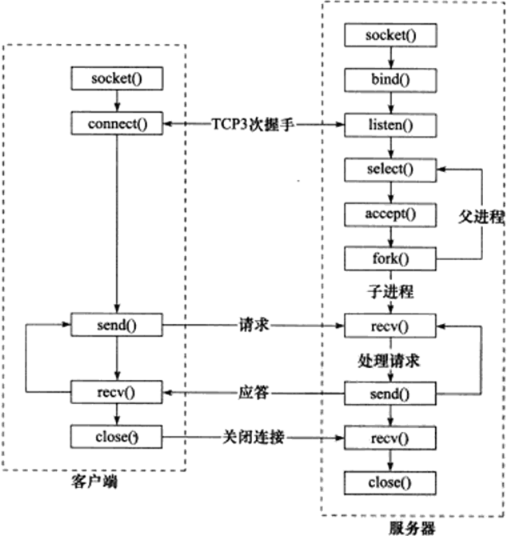
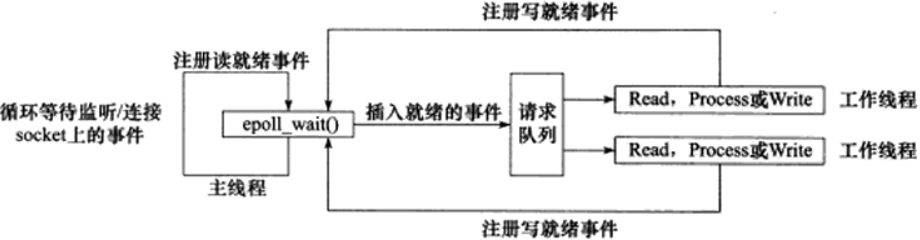
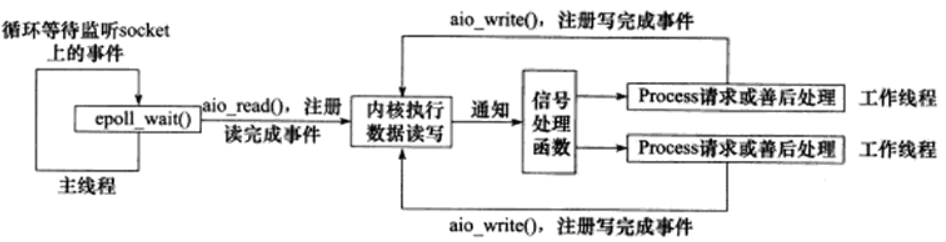
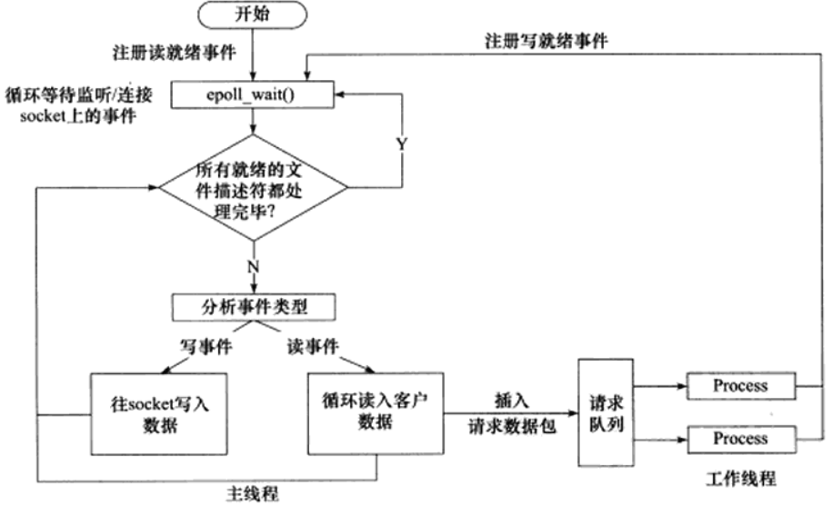

# 高性能服务器程序框架

按照服务器程序的一般原理，服务器包含三个主要模块：
- I/O处理单元。
- 逻辑单元。
- 存储单元。（可选模块，与网络编程无关）

## 服务器模型

**C/S模型**

C/S（客户端/服务器）模型：所有客户端都通过访问服务器来获取所需资源。

由于客户连接请求是随机到达的异步事件，服务器需要使用某种I/O模型来监听这一事件。I/O模型有多种，例如I/O复用技术之一的select系统调用：当监听到连接请求后，服务器调用accept并分配一个逻辑单元（子进程、子线程或其他）为新的连接服务。

C/S模型适合资源相对集中的场合，并且实现简单，但其缺点是：访问量过大时，可能所有客户都将得到很慢的相应。

**P2P模型**

P2P（Peer to Peer，点对点）模型更符合网络通信的实际情况。网络上所有主机地位对等。

每台机器在消耗服务的同时也给别人提供服务。然而，主机之间很难互相发现，通常带有一个专门的发现服务器。

## I/O模型 
|I/O模型|读写操作和阻塞阶段|
|---|---|
|阻塞I/O（同步）|程序阻塞与读写函数|
|I/O复用（同步）|程序阻塞与I/O复用系统调用，但可同时监听多个I/O事件。对I/O本身读写是非阻塞|
|SIGIO信号（同步）|信号出发读写就绪事件，用户程序执行读写操作。程序没有阻塞|
|异步I/O|内核执行读写操作并触发读写完成时间。程序没有阻塞|

## 事件处理模式

服务器通常需要处理三类事件：I/O事件、信号及定时事件。

**Reactor模式**

主线程（I/O处理单元）只负责监听文件描述上是否有事件发生，如果有则立即通知工作线程（逻辑单元）。读写数据、接受新的连接以及处理客户请求均在工作线程完成。

使用同步I/O模型（epoll_wait为例）实现Reactor模式：

**Proactor模式**

所有I/O操作都交给主线程和内核处理，工作线程仅仅负责业务逻辑。Proactor模式更符合服务器编程框架。

使用异步I/O模型（aio_read和aio_write为例）实现Proactor模式：

**模拟Proactor模式**

使用同步I/O模型（epoll_wait为例）模拟出Proactor模式：

## 并发模式

服务器主要有两种并发编程模式：半同步/半异步模式和领导者/追随者模式。

**半同步/半异步模式**

- 同步模式：程序完全按照代码顺序执行；
- 异步模式：程序执行由系统事件来驱动，比如中断、信号等。

服务器既要求较好的实时性，又要求能同时处理多个客户请求的应用程序，应采用半同步/半异步模式来实现。异步线程用于处理I/O事件，同步线程处理客户逻辑。

**领导者/追随者模式**

多个工作线程轮流获得事件源集合，轮流监听、分发并处理事件。

任何时间点，程序仅有一个领导者线程，负责监听I/O事件，其他线程都是追随者，休眠在线程池中等待成为新的领导者。
当前领导者如果检测到I/O事件，首先从线程池中选出新领导者线程，然后处理I/O事件。

## 性能提高的一些细节

**池**

池是一组资源的集合，这组资源在服务器启动之初就被完全创建好并初始化，这称为静态资源分配。运行时，服务器需要相关资源就可以直接从池中获取，使用完放回池中。

优点：池相当于服务器管理系统资源的应用层设施，避免了服务器对内核的频繁访问。

根据不同资源类型，池可以分为：内存池（接收发送缓存）、进程池、线程池和连接池。

**数据复制**

高性能服务器应当避免不必要的数据复制，尤其是当数据复制发生在用户代码和内核之间的时候。

如果内核可以直接处理从socket或者文件读入的数据，则应当避免数据从内核缓冲区复制到应用程序缓冲区中。例如：零拷贝函数。

用户代码内部的数据复制也可以避免。例如，两个进程传递大量数据，考虑使用共享内存，而不是管道或者消息队列来传递。

**上下文切换和锁**

并发程序必须考虑上下文切换的问题，即进程切换或线程切换导致的系统开销。工作线程或工作进程不宜设置过多。

锁通常被认为是导致服务器效率低下的一个因素，因为它引入的代码不仅不处理任何业务逻辑，而且需要访问内核资源。服务器如果有更好的解决方案，应当避免使用锁。例如：考虑减小锁的粒度，使用读写锁。

