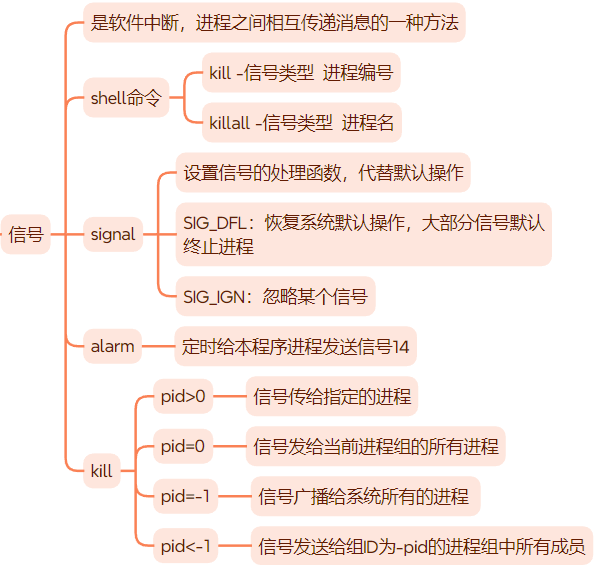

# 信号

## 回顾
<div align=center>

</div>

## sigaction系统调用

设置信号处理函数更健壮的接口
```c++
#include <signal.h>
int sigaction(int sig, const struct sigaction* act, struct sigaction*oact);
```

`act`指定新的信号处理方式，`oact`输出先前的信号处理方式。

`sigaction`结构体描述了信号处理的细节：
```c++
struct sigaction {
    void     (*sa_handler)(int); // 信号处理函数
    void     (*sa_sigaction)(int, siginfo_t *, void *);
    sigset_t   sa_mask; // 信号掩码（在进程原有信号掩码基础上）
    int        sa_flags;
    void     (*sa_restorer)(void); // 过时，最好不使用
};
```

## 信号集

Linux使用数据结构`sigset_t`表示一组信号（实际上是一个长整型数组），并且提供一组函数来设置、修改、删除和查询：

```c++
int sigemptyset(sigset_t *set); // 清空信号集
int sigfillset(sigset_t *set); // 在信号集中设置所有信号
int sigaddset(sigset_t *set, int signum); // 将信号添加至信号集
int sigdelset(sigset_t *set, int signum); // 将信号从信号集中删除
int sigismember(const sigset_t *set, int signum); // 测试是否在信号集中
```

设置和查看进程的信号掩码：
```c++
int sigprocmask(int how, const sigset_t *set, sigset_t *oldset);
```

设置进程信号掩码后，此时给进程发送一个被屏蔽的信号，操作系统将该信号设置为进程的一个被挂起的信号。如果取消被挂起信号的屏蔽，进程能够立即接收到该信号。获取当前进程被挂起的信号集：
```c++
int sigpending(sigset_t* set);
```

## 信号与I/O事件同一处理

信号处理函数需要尽可能快地执行完毕，以确保该信号不被屏蔽太久。
> 为了避免一些竞态条件，信号在处理期间，系统不会再次触发它。

一种典型的解决方案是：信号处理逻辑放到程序主循环，信号处理函数只是简单地通知主循环程序接收到信号。通常使用管道实现信号“传递”给主循环，结合I/O复用，信号事件就能和其他I/O事件一起处理。

## 网络编程相关信号

**SIGHUP**

挂起进程的控制终端时，`SIGHUP`信号触发。而对于没有控制终端的网络后台程序而言，通常利用`SIGHUP`信号来强制服务器重读配置文件。

**SIGPIPE**

默认情况下，`SIGPIPE`会引发结束进程，而我们不希望因为错误的写操作而导致程序退出。使用`send`函数的`MSG_NOSIGNAL`标志来禁止写操作触发`SIGPIPE`信号。此时应该使用errno值来判断管道或者、socket连接的读端是否关闭。

此外，也可以利用I/O复用系统调用来检测。以epoll为例，当管道读端关闭，写端文件描述符`POLLHUP`事件被触发；socket连接被对方关闭时，socket上的`POLLRDHUP`事件触发。

**SIGURG**

Linux环境下，内核通知应用程序带外数据到达主要有两种方法：
- I/O复用技术
- 使用`SIGURG`信号
