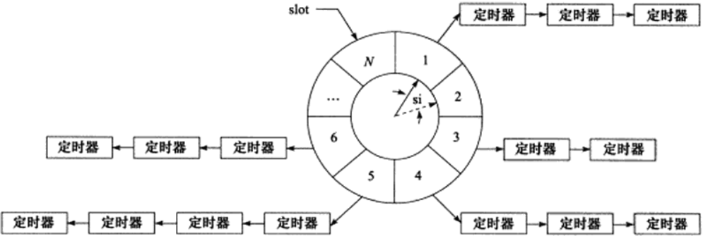

# 定时器

网络程序需要处理的第三类事件时定时事件，比如定期检测一个客户连接的活动状态。

服务器通常管理着众多定时事件，因此需要将每个定时事件封装成定时器，并使用数据结构统一管理。高效的管理定时器的容器有：时间轮和时间堆。

Linux提供了三种定时方法：
- socket选项`SO_RCVTIMEO`和`SO_SNDTIMEO`
- `SIGALRM`信号
- I/O复用系统调用的超时参数

## 时间轮
——哈希表

时间轮内，指针指向轮子上的一个槽，它以恒定速度顺时针转动，每间隔si转动一步指向下一个槽，时间轮共有N个槽，旋转一周的时间是N*si。

每个槽指向一条定时器链表，每条链表上的定时器具有相同特征：定时时间相差N*si的整数倍。

假如现在指针指向槽cs，添加一个定时时间为ti的定时器，则该定时器将被插入槽ts对应的链表中：
$$ts=(cs+(ti/si))\%N$$

显然，对于时间轮来说，要提高定时精度，si要足够小；要提高执行效率，N要足够大。

对于复杂的时间轮可能有多个轮子，不同的轮子拥有不同的粒度，类似于时钟里的时分秒。

## 时间堆
——小堆

设计定时器另外一种思路：将所有定时器中超时时间最小的值作为心搏间隔，一旦心搏函数调用，处理超时时间最小的定时器，然后重新找到超时时间最小的一个作为下一次心搏。

