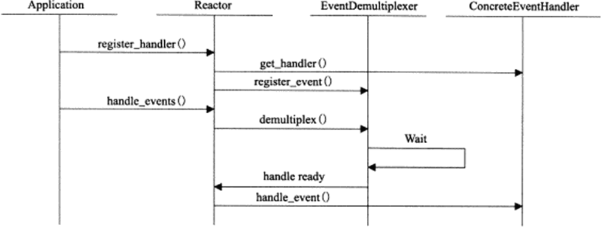

# 高性能I/O

Linux服务器三类事件：I/O事件、信号和定时事件。在处理这三类事件时，需要考虑：
- 统一事件源。利用I/O复用系统调用来管理所有事件。
- 可移植性。不同操作系统具有不同的I/O复用方式，例如FreeBSD的kqueue机制和Linux的epoll系列系统函数。
- 对并发编程的支持。各执行体如何协同处理客户连接、信号和定时器，避免竞态条件。

基于Reactor模式的I/O框架包含以下组件：
- **句柄**
  
  一个事件源通常与一个句柄绑定在一起，当内核检测到就绪事件，通过句柄通知应用程序。Linux环境下，I/O事件对应句柄是文件描述符，信号事件对应的句柄是信号值。
- **事件多路分发器**
  
  在事件循环中，等待事件一般使用I/O复用技术实现。I/O框架库将各种I/O复用封装成统一接口，实现事件多路分发器。
- **事件处理器**
  
  执行事件对应的业务逻辑。用户需要继承实现自己的事件处理器。  
- **Reactor**
  
  I/O框架库的核心。

开源高性能I/O框架：[Libevent](https://aceld.gitbooks.io/libevent/content/chapter1.html)
